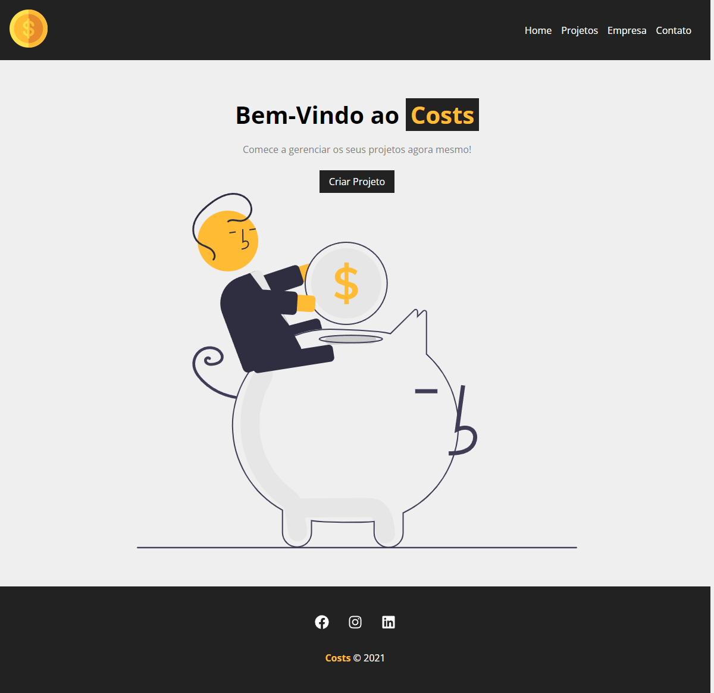
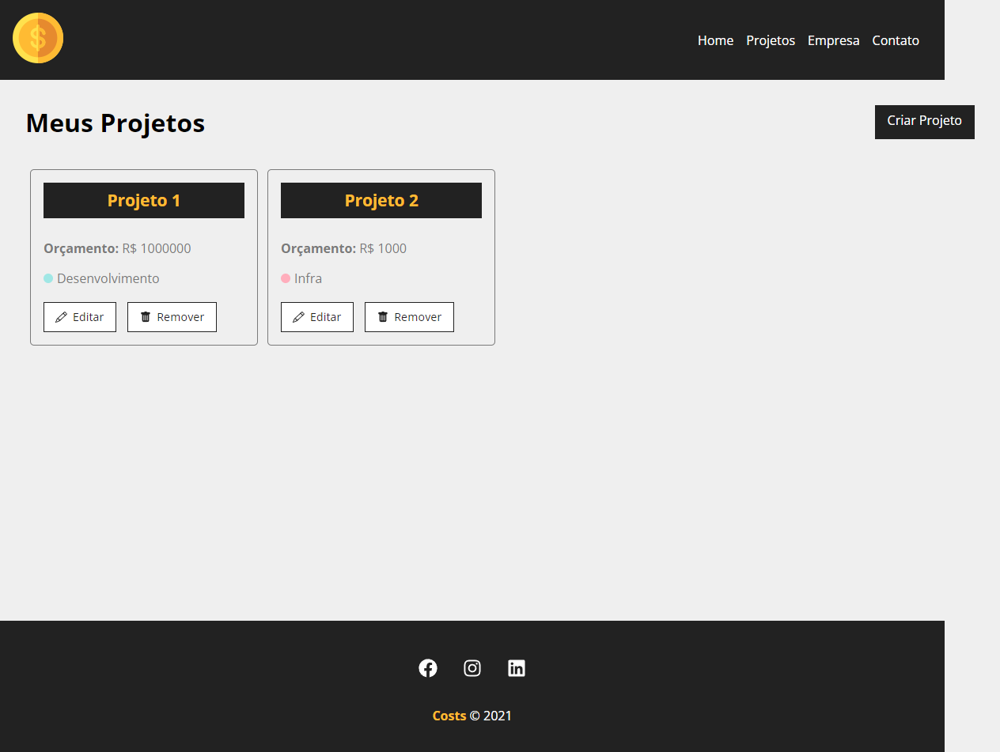
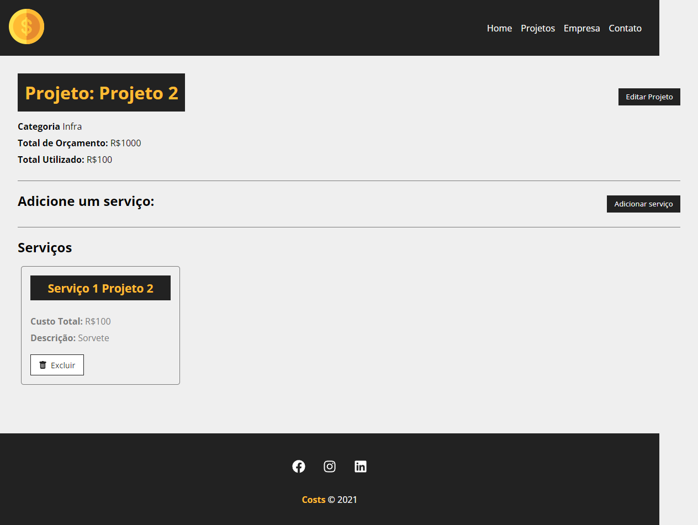
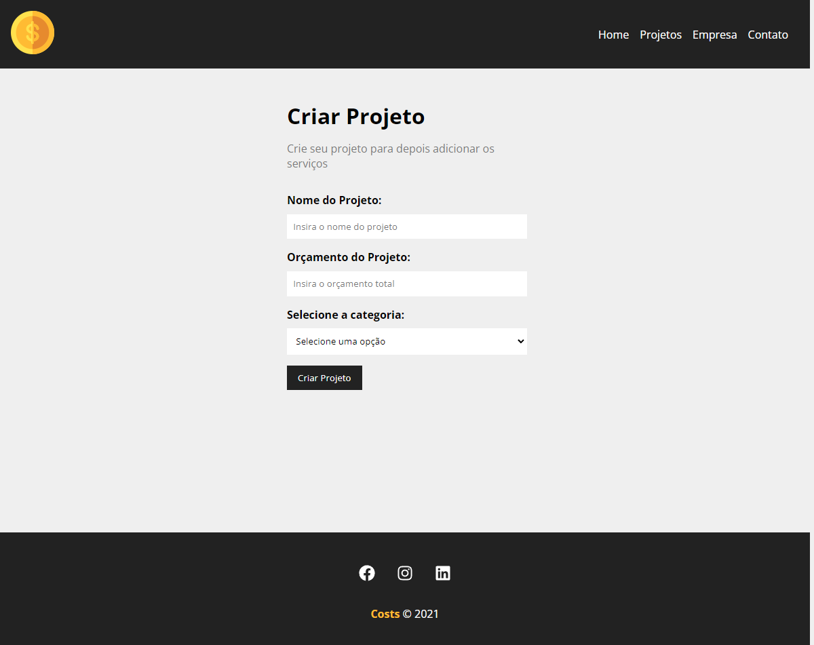
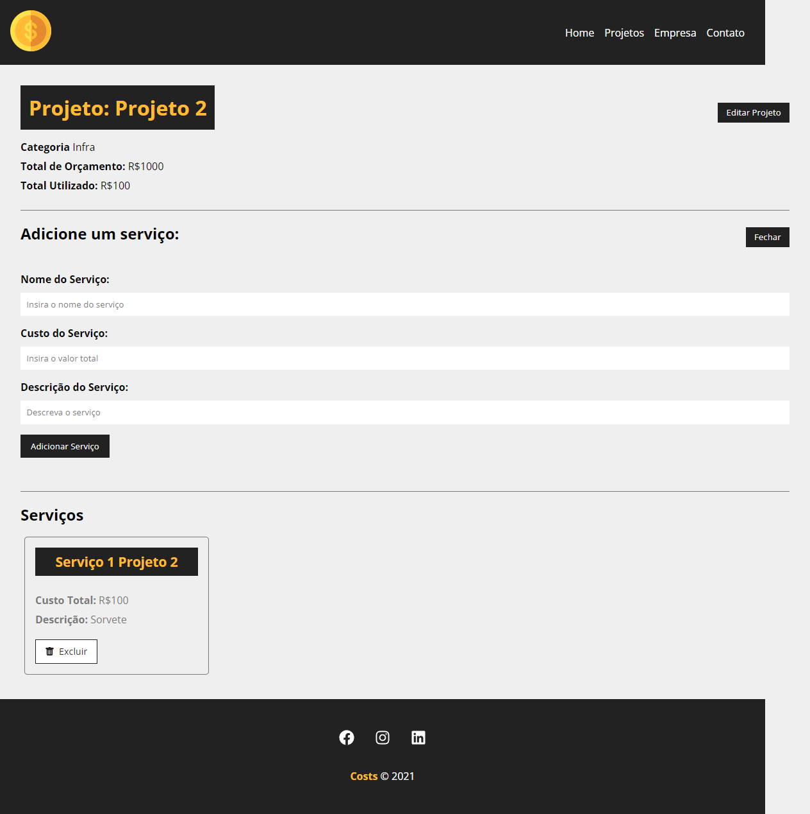
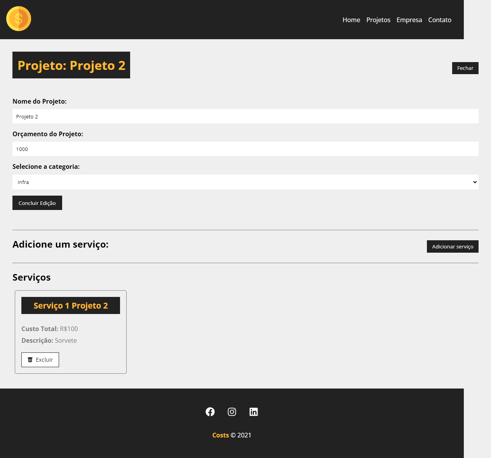

# WorkShop grátis de React.JS

Projeto de gerenciamento de custos de serviços feito em React.JS com um Back-End "fake" utilizando JSON Server, 
o projeto foi desenvolvido pelo Matheus Battisti do canal do Youtube - Hora de Codar.

- Nesse curso foi possível aprender mais sobre os Hooks do react, assim como toda a parte básica de componentização e consumo de APIs.
- Também foi possível aprender sobre funcionalidades do próprio JavaScript.

Algumas imagens do sistema final:

**Obs: Os prints sairam com um espaço lateral por conta do uso da ferramente de prints do chrome, porém não ficam assim projeto**

  
  
  
  
  
  

